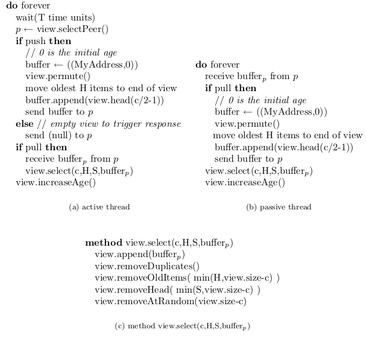
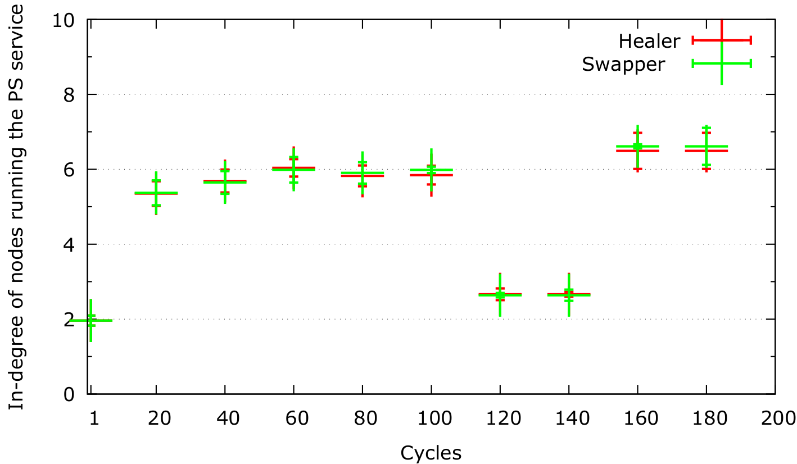
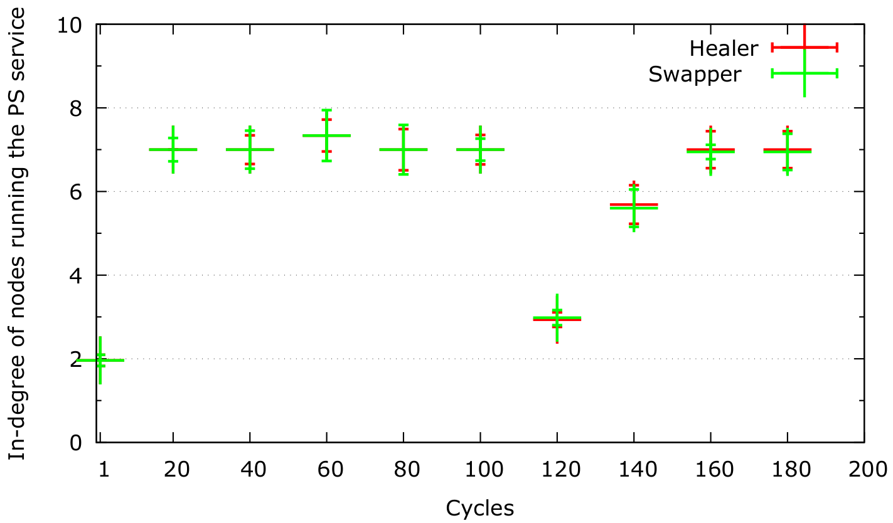

# Projet Erlang 

**LINGI2345 Autumn, 2020** -- *Guillaume Cornette and Sébastien Pierre*

## Introduction
For the LINGI2345 course, we were asked to implement a Peer Sampling service with Erlang. The main idea is to have a network of nodes where every node send a message to one of his neighbours. Each node update his neighbours in every round by removing duplicate nodes, oldest nodes, etc.. in order to keep 'C' neighbours. All the nodes are managed by a main thread that keep a trace of the execution and follow a scenario in order to kill or add nodes to the network. <br />

The log of the project print the view of each node with its PID and its ID. It contains too the node's indegree at the end of a round. 
## Script
To ease the use of the project, we make a script [`script.sh`](script.sh) because it takes time to run all the compiling lines in the erlang terminal and to launch the methods. You only have to run ```./script.sh``` in your terminal and to follow the instructions. 
<br />

You will be able to choose between the healer policy or the swapper policy. In each case, you can only choose the view selection policy (```rand``` or ```tail```). <br />
It will use the value recommanded in the Github for the healer (C = 7, H = 4, N = 128, S = 3) and for the swapper (C = 7, H = 4, N = 128, S = 3).
<br />

If you want to use your own values for the launch, you can! In the first question, you can choose custom and the script will ask you wich value you want to use for every input. 

## Indegree
The indegree of a node is the number of nodes that has this node in its view. The idea to calculate the indegree is to take the view of each node and to keep a list of counter for each node. We increase a counter when the node is in the view of a node. 
The indegree is calculated in the main thread. Every round, it receives a message from every node with its view that it logs. The main thread uses this view by sending it to a function : ```checkView```
<br />

``` erlang
% Update the Indegree given the node's view
% pre : List[Integer, Integer, PID], List[Integer, Integer]
checkView(View, IndegreeLog) -> 
  if 
    length(View) =:= 0 ->
      IndegreeLog;
    length(View) =/= 0 -> 
      Id=lists:nth(2,hd(View)),
      Pre = searchList(IndegreeLog, Id, 1),
      if 
        Pre =:= -1 ->
          checkView(tl(View), IndegreeLog++[[Id,"<--ID | Degree-->",  1]]);
        Pre =/= -1 -> 
          Number=lists:last(lists:nth(Pre, IndegreeLog))+1,
          FirstList=lists:sublist(IndegreeLog, 1, Pre-1)++[[Id, "<--ID | Degree-->", Number]],
          
          checkView(tl(View), FirstList++lists:sublist(IndegreeLog, Pre+1, length(IndegreeLog)))
      end
  end.
```
As you can see, it takes 2 arguments, the view and the current indegree list. The function goes through the ```View``` and increase the values in the list of ```IndegreeLog``` according to the nodes in the ```View```. 
## Active & Passif Thread
The active & passif thread part is in every node and manage the add/remove neighbour by the message received in the inBuffer. 
<br />

For our implementation, we follow the article of [Jelasity M. et al 2007](https://dl.acm.org/doi/10.1145/1275517.1275520). There is the pseudo-code : 



As you can see, there is a part of the active thread that waits to get a message. The message must be send by the thread which we use to send our buffer in the active thread. However, there is a possible issue that the node has crashed and never send the message. 

We don't implement exactly like in the pseudo-code because it needs two threads for each part (passif and actif). But we use a unique thread for the same node. We implement a method ```listen``` : 

``` erlang
% Manage the message receive to the thread to pass in the passive and in the active. 
% pre : #state(view=List[List[age, List]], c=Int, h=Int, s=Int, select=String)
listen(Tuple, PID_p) -> %Tuple = [view:View, c=C , h:H, s=S, select:Select, id:NodeId]  & View = [[PID, H], [], [] , ... ]
  receive

    % Ask for information about a Node
    {info, NodeId, BootstrapServer, C, S, H, Select} -> 
      State = #state{view=[], c=C, h=H, s=S, select=Select, id=NodeId},
      Number = getNeigs(BootstrapServer, NodeId),
      infoAboutNeighbours(element(1, Number), PID_p),
      listen(State, PID_p);
    
    % Receive the information from the main thread
    {ok, GetPID, ID} -> 
      State = #state{view=Tuple#state.view++[[0, ID-1,GetPID]], c=Tuple#state.c, h=Tuple#state.h, s=Tuple#state.s, select=Tuple#state.select, id=Tuple#state.id},
      listen(State, PID_p);
    
    % Call the active thread
    {time} ->  
      PID_p ! {console, Tuple#state.view, Tuple#state.id, self()},
      if
        Tuple#state.select =:= "rand" ->
          RandNum = rand:uniform(length(Tuple#state.view)),
          PID = lists:last(lists:nth(RandNum, Tuple#state.view));
        Tuple#state.select =:= "tail" ->
          Sort = lists:sort(fun([X,_,_], [Y,_,_]) -> X >= Y end, Tuple#state.view),
          PID = lists:last(lists:last(Sort))
      end,
      doActiveThread(PID, Tuple),
      listen(Tuple, PID_p);
    
    % React when a passive callback the active thread
    {pushback, Buffer} -> 
      State = doPullActive(Buffer, Tuple),
      PID_p ! {log, State#state.view, self()},
      listen(State, PID_p);

    % Call the passive thread
    {pushcall, From, Buffer} -> 
      State = doPassiveThread(From, Buffer, Tuple),
      listen(State, PID_p)
  end.
```

This method is launched at the creation of each the node. In this part, we listen the message sent by the main thread and the others nodes. Here are the types of messages : 
- ```{time}``` : Message from the main thread, run the actif thread;
- ```{pushcall, PID, List}``` : Message from a node, run the passif thread;
- ```{pushback, View}``` : Message from a node, run the waiting part of the actif thread;
- ```{info, Integer, PID, Integer, Integer, Integer, String}``` : Message from the main thread to give the data that the node needs (neighbour, Id, etc.);
- ```{ok, PID, Integer}``` : Message from the main thread, give the neighbours.

As we explain previously, there is a part that must wait in the active thread. We create the ```pushback``` message that is sent by the passive thread to react to the message from the active thread. In this way, the thread doesn't have to wait and it can work while the passive thread send the message. If the passive thread crash, the thread will not be stuck in the active thread to wait for the answer with this strategy.  

## Plots analysis 
This plot use tail selection:

This plot use rand selection:


We have done two plots thanks to Docker. Each plot uses two data : Healer and Swapper mean of in-degree and standard deviation (every 20 cycles)of the in-degree. The two plots differs from their peer selection, one with tail and one with rand.

The first plot uses the tail peer selection, we can see that the first cycle has a low mean (approximetively 2 of in-degree because the service start with only 40% of the peers and it's the begining) and then converges to 7. There is a drop of the mean at 120 and 140 cycles because of the crash scenario. The swapp and healer selection have almost the same results for the mean and standard deviation. After the crash the mean doesn't change until we add new nodes at the 150th cycle. As we may observe with the tail, the node has some difficulties to integrate the network again. Moreover, the nodes that didn't crash will stay focus on the crashed nodes with this Selection until they got new view from other. 

The second plot uses the rand peer selection, what we can conclude is that the first cycle is almost the same as the tail peer selection. But after that the mean of the in-degree for every 20 cycles is almost seven. So it converges faster to the size of the view than tail peer selection. The healer and swapper gives approximatively the same results except at the 120th and 140th cycles where the Healer has a lower mean.After the crash the mean is increasing to reach back a mean of appromaxitevly 7. The rand has a better result after the crash because it doesn't send always to the oldest node and share its view with different nodes. It mades the integration of the new nodes easier. 